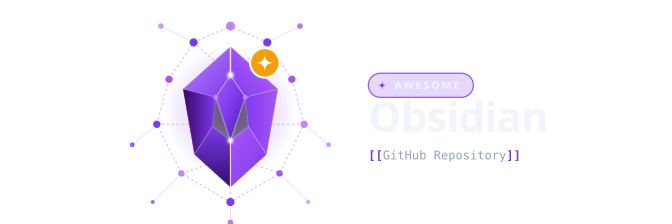

<!-- markdownlint-disable -->
<p align="center">

</p>
<blockquote align="center"> A curated List of Awesome Obsidian Themes, Plugins and Resources</blockquote>

<p align="center">
[
  <a href="#-contribute">Contribute</a> •
  <a href="#%EF%B8%8F-code-of-conduct">Code of Conduct</a> •
  <a href="#-communities">Communities</a> •
  <a href="https://github.com/awesome-obsidian/awesome-obsidian/issues/new?template=suggest-project.yml">Suggest a Project</a> •
  <a href="https://github.com/awesome-obsidian/awesome-obsidian/issues">Issues</a> •
  <a href="https://github.com/awesome-obsidian/awesome-obsidian/pulls">Pull Requests</a>
]
</p>

<h2>Obsidian</h2>

<div align="right">
<a href="https://obsidian.md/">
  
</a>
</div>

[Obsidian](https://obsidian.md/) is a powerful knowledge management and note-taking application 
built around local Markdown files and interconnected notes. It combines 
a fast, flexible editor with backlinks, graph views, properties, plugins, 
themes, and an extensive ecosystem of community-built tools.

## Contents

- [🔌 Plugins](#-plugins) _0 projects_
- [🎨 Themes](#-themes) _0 projects_
- [🌈 CSS Snippets](#-css-snippets) _6 projects_
- [🖼️ Assets](#-assets) _1 projects_
- [💡 Templates](#-templates) _2 projects_
- [📊 Dataview](#-dataview) _4 projects_
- [🏠 Vaults](#-vaults) _3 projects_
- [🔄 Workflows](#-workflows) _10 projects_
- [🔗 Integrations](#-integrations) _3 projects_
- [🛠️ Tools](#-tools) _2 projects_
- [🌐 Static-Site Generators](#-static-site-generators) _4 projects_
- [🖇️ Related](#-related) _4 projects_

## Explanation
- 🥇🥈🥉&nbsp; Combined project-quality score
- ⭐️&nbsp; Star count from GitHub
- 🐣&nbsp; New project _(less than 6 months old)_
- 💤&nbsp; Inactive project _(12 months no activity)_
- 💀&nbsp; Dead project _(9999 months no activity)_
- 📈📉&nbsp; Project is trending up or down
- ➕&nbsp; Project was recently added
- ❗️&nbsp; Warning _(e.g. missing/risky license)_
- 👨‍💻&nbsp; Contributors count from GitHub
- 🔀&nbsp; Fork count from GitHub
- 📋&nbsp; Issue count from GitHub
- ⏱️&nbsp; Last update timestamp on package manager
- 📥&nbsp; Download count from package manager
- 📦&nbsp; Number of dependent projects
- &nbsp; Built and maintained directly by the Obsidian team

<br>

## 🔌 Plugins

<a href="#contents"></a>

_Community plugins that extend Obsidian with new features, tools, and capabilities (TBA) [For now use the official Obsidian Community (https://community.obsidian.md/search?type=plugin)]_

<br>

## 🎨 Themes

<a href="#contents"></a>

_Themes and visual styles for customizing the look and feel of Obsidian (TBA) [For now use the official Obsidian Community (https://community.obsidian.md/search?type=theme)]_

<br>

## 🌈 CSS Snippets

<a href="#contents"></a>

_Custom CSS snippets for modifying and enhancing the Obsidian interface_

<details><summary><b><a href="https://github.com/efemkay/obsidian-modular-css-layout">Modular CSS Layout</a></b> (🥇16 ·  ⭐ 1.8K · 💤) - CSS Layout hack for Obsidian.md. <code><a href="http://bit.ly/2M0xdwT">❗️GPL-3.0</a></code></summary><a href="https://github.com/efemkay/obsidian-modular-css-layout">

</a>


- [GitHub](https://github.com/efemkay/obsidian-modular-css-layout) (👨‍💻 3 · 🔀 110 · 📥 10K · 📋 110 - 53% open · ⏱️ 01.09.2024):

	```
	git clone https://github.com/efemkay/obsidian-modular-css-layout
	```
</details>
<details><summary><b><a href="https://github.com/r-u-s-h-i-k-e-s-h/Obsidian-CSS-Snippets">Obsidian CSS Snippets</a></b> (🥈13 ·  ⭐ 1.6K) - Welcome to the ObsidianMD CSS Snippets repository, a collection of CSS code snippets to enhance the user interface.. <code><a href="http://bit.ly/34MBwT8">MIT</a></code></summary><a href="https://github.com/r-u-s-h-i-k-e-s-h/Obsidian-CSS-Snippets">

</a>


- [GitHub](https://github.com/r-u-s-h-i-k-e-s-h/Obsidian-CSS-Snippets) (👨‍💻 10 · 🔀 76 · ⏱️ 22.07.2026):

	```
	git clone https://github.com/r-u-s-h-i-k-e-s-h/Obsidian-CSS-Snippets
	```
</details>
<details><summary><b><a href="https://github.com/Dmytro-Shulha/obsidian-css-snippets">Common CSS Snippets for Obsidian</a></b> (🥈11 ·  ⭐ 1.8K · 💤) - Most common appearance solutions for Obsidian now in a single place. Initially collected by Klaas:.. <code>❗Unlicensed</code></summary><a href="https://github.com/Dmytro-Shulha/obsidian-css-snippets">

</a>


- [GitHub](https://github.com/Dmytro-Shulha/obsidian-css-snippets) (👨‍💻 13 · 🔀 160 · 📋 8 - 62% open · ⏱️ 15.12.2024):

	```
	git clone https://github.com/Dmytro-Shulha/obsidian-css-snippets
	```
</details>
<details><summary><b><a href="https://github.com/replete/obsidian-minimal-theme-css-snippets">Minimal Theme CSS Snippets</a></b> (🥉9 ·  ⭐ 520) - Obsidian CSS snippets to tweak UI and harmonize various plugins with the Minimal Theme - for fellow hackers. <code>❗Unlicensed</code></summary><a href="https://github.com/replete/obsidian-minimal-theme-css-snippets">

</a>


- [GitHub](https://github.com/replete/obsidian-minimal-theme-css-snippets) (👨‍💻 4 · 🔀 27 · 📋 12 - 8% open · ⏱️ 10.05.2026):

	```
	git clone https://github.com/replete/obsidian-minimal-theme-css-snippets
	```
</details>
<details><summary><b><a href="https://github.com/sailKiteV/Obsidian-Snippets-and-Demos">CSS Snippets & Demos</a></b> (🥉7 ·  ⭐ 110) - A collection of CSS snippets, Markdown files, and visual examples of fun little tricks and techniques for use in the.. <code><a href="http://bit.ly/34MBwT8">MIT</a></code></summary><a href="https://github.com/sailKiteV/Obsidian-Snippets-and-Demos">

</a>


- [GitHub](https://github.com/sailKiteV/Obsidian-Snippets-and-Demos) (👨‍💻 3 · 🔀 4 · 📋 2 - 50% open · ⏱️ 18.01.2026):

	```
	git clone https://github.com/sailKiteV/Obsidian-Snippets-and-Demos
	```
</details>
<details><summary><b><a href="https://github.com/gsarig/obsidian-css-snippets">gsarig CSS Snippets</a></b> (🥉5 ·  ⭐ 160) - CSS Snippets for Obsidian. <code>❗Unlicensed</code></summary><a href="https://github.com/gsarig/obsidian-css-snippets">

</a>


- [GitHub](https://github.com/gsarig/obsidian-css-snippets) (🔀 6 · ⏱️ 05.05.2026):

	```
	git clone https://github.com/gsarig/obsidian-css-snippets
	```
</details>
<br>

## 🖼️ Assets

<a href="#contents"></a>

_Icons, banners, fonts, images, and other visual resources for Obsidian_

<details><summary><b><a href="https://github.com/obsidian-tasks-group/obsidian-tasks-custom-icons">Tasks Custom Icons</a></b> (🥇6 ·  ⭐ 84 · 💤) - Replace emojis used in Obsidian Tasks with monotone SVGs (obsidian css snippet generator). <code>❗Unlicensed</code></summary><a href="https://github.com/obsidian-tasks-group/obsidian-tasks-custom-icons">

</a>


- [GitHub](https://github.com/obsidian-tasks-group/obsidian-tasks-custom-icons) (👨‍💻 6 · 🔀 10 · ⏱️ 30.09.2024):

	```
	git clone https://github.com/obsidian-tasks-group/obsidian-tasks-custom-icons
	```
</details>
<br>

## 💡 Templates

<a href="#contents"></a>

_Ready-to-use templates for notes, projects, meetings, study, and everyday workflows_

<details><summary><b><a href="https://github.com/groepl/Obsidian-Templates">Zettelkasten Templates & Scripts</a></b> (🥇20 ·  ⭐ 1.9K) - A repository containing templates and scripts for #Obsidian to support the #Zettelkasten method for note-taking. <code><a href="http://bit.ly/34MBwT8">MIT</a></code></summary><a href="https://github.com/groepl/Obsidian-Templates">

</a>


- [GitHub](https://github.com/groepl/Obsidian-Templates) (🔀 170 · ⏱️ 22.08.2026):

	```
	git clone https://github.com/groepl/Obsidian-Templates
	```
</details>
<details><summary><b><a href="https://github.com/kepano/clipper-templates">Web Clipper Templates</a></b> (🥉12 ·  ⭐ 1.4K) - Obsidian Web Clipper templates for various sites. <code><a href="http://bit.ly/34MBwT8">MIT</a></code></summary><a href="https://github.com/kepano/clipper-templates">

</a>


- [GitHub](https://github.com/kepano/clipper-templates) (👨‍💻 9 · 🔀 110 · ⏱️ 13.03.2026):

	```
	git clone https://github.com/kepano/clipper-templates
	```
</details>
<br>

## 📊 Dataview

<a href="#contents"></a>

_Queries, DataviewJS scripts, dashboards, tables, and dynamic views for your vault_

<details><summary><b><a href="https://github.com/PandoraReads/apex-dashboard/blob/main/README_EN.md">Apex Dashboard</a></b> (🥇21 ·  ⭐ 740 · 🐣) - Stop switching between Obsidian notes. One page. Everything you need. Memo your thoughts, crush your todos, track your.. <code><a href="http://bit.ly/34MBwT8">MIT</a></code></summary><a href="https://github.com/PandoraReads/apex-dashboard/blob/main/README_EN.md">

</a>


- [GitHub](https://github.com/PandoraReads/apex-dashboard) (🔀 43 · 📥 86K · 📋 44 - 27% open · ⏱️ 03.09.2026):

	```
	git clone https://github.com/PandoraReads/apex-dashboard
	```
</details>
<details><summary><b><a href="https://github.com/s-blu/obsidian_dataview_example_vault">Dataview Example Vault</a></b> (🥈10 ·  ⭐ 860 · 💤) - A example vault to collect and showcase various dataview queries. Created on behalf of AB1908. <code>❗Unlicensed</code></summary><a href="https://github.com/s-blu/obsidian_dataview_example_vault">

</a>


- [GitHub](https://github.com/s-blu/obsidian_dataview_example_vault) (👨‍💻 14 · 🔀 92 · 📋 11 - 18% open · ⏱️ 11.07.2025):

	```
	git clone https://github.com/s-blu/obsidian_dataview_example_vault
	```
</details>
<details><summary><b><a href="https://obsidian.inlitx.xyz/">Dashboard Gallery</a></b> (🥈10 ·  ⭐ 700) - Beautiful, ready-to-use dashboard templates for Obsidian PKM. <code><a href="http://bit.ly/34MBwT8">MIT</a></code></summary><a href="https://obsidian.inlitx.xyz/">

</a>


- [GitHub](https://github.com/InlitX/Obsidian-Dashboard-Gallery) (👨‍💻 2 · 🔀 37 · ⏱️ 29.07.2026):

	```
	git clone https://github.com/InlitX/Obsidian-Dashboard-Gallery
	```
</details>
<details><summary><b><a href="https://github.com/Aetherinox/obsidian-dataview-snippets">Dataview Snippets Collection</a></b> (🥉8 ·  ⭐ 190 · 💤) - A collection of Obsidian.md scripts which include Tag & Page Clouds, Table of Contents / ToC, Bad / Missing Link.. <code><a href="http://bit.ly/34MBwT8">MIT</a></code></summary><a href="https://github.com/Aetherinox/obsidian-dataview-snippets">

</a>


- [GitHub](https://github.com/Aetherinox/obsidian-dataview-snippets) (👨‍💻 2 · 🔀 7 · 📥 61 · ⏱️ 11.07.2025):

	```
	git clone https://github.com/Aetherinox/obsidian-dataview-snippets
	```
</details>
<br>

## 🏠 Vaults

<a href="#contents"></a>

_Complete vaults, vault structures, and setups for inspiration and reuse_

<details><summary><b><a href="https://stephango.com/vault">kepano's Obsidian Vault</a></b> (🥇16 ·  ⭐ 4.5K) - My personal Obsidian vault template. A bottom-up approach to note-taking and organizing things I am interested in. <code><a href="http://bit.ly/34MBwT8">MIT</a></code></summary><a href="https://stephango.com/vault">

</a>


- [GitHub](https://github.com/kepano/kepano-obsidian) (👨‍💻 9 · 🔀 360 · 📋 19 - 26% open · ⏱️ 09.01.2026):

	```
	git clone https://github.com/kepano/kepano-obsidian
	```
</details>
<details><summary><b><a href="https://github.com/jrgilbertson/networked-thinking">Networked Thinking: Companion Vault</a></b> (🥉11 ·  ⭐ 150) - An Obsidian companion vault for putting Networked Thinking into practice, with the notes, templates, and folder.. <code>❗Unlicensed</code></summary><a href="https://github.com/jrgilbertson/networked-thinking">

</a>


- [GitHub](https://github.com/jrgilbertson/networked-thinking) (👨‍💻 2 · 🔀 16 · 📋 7 - 42% open · ⏱️ 19.08.2026):

	```
	git clone https://github.com/jrgilbertson/networked-thinking
	```
</details>
<details><summary><b><a href="https://vaultorial.com/">Vaultorial Obsidian Templates</a></b> (🥉3 ·  ⭐ 8 · 🐣) -  <code><a href="http://bit.ly/34MBwT8">MIT</a></code></summary><a href="https://vaultorial.com/">

</a>


- [GitHub](https://github.com/Vaultorial/obsidian-templates) (⏱️ 11.06.2026):

	```
	git clone https://github.com/Vaultorial/obsidian-templates
	```
</details>
<br>

## 🔄 Workflows

<a href="#contents"></a>

_Practical workflows, productivity systems, and methods for getting more out of Obsidian_

🔗&nbsp;<b><a href="https://gist.github.com/karpathy/442a6bf555914893e9891c11519de94f">Karpathy's LLM Wiki</a></b>  - A personal wiki by Andrej Karpathy for organizing and exploring concepts, ideas, and resources related to large..

🔗&nbsp;<b><a href="https://www.linkingyourthinking.com/">Linking Your Thinking</a></b>  - A knowledge management framework focused on connected thinking, Maps of Content, and building a personal knowledge..

🔗&nbsp;<b><a href="https://networkedthinking.ai/">Networked Thinking</a></b>  - A connected note-taking and knowledge management system that combines atomic notes, purposeful links, knowledge maps,..

🔗&nbsp;<b><a href="https://zettelkasten.de/overview/">Zettelkasten</a></b>  - A method for developing interconnected notes and ideas through atomic notes, links, and a networked system of knowledge.

🔗&nbsp;<b><a href="https://fortelabs.com/blog/para/">PARA (Project, Area, Resource, Archive)</a></b>  - A practical organization system for managing information by organizing it into Projects, Areas, Resources, and Archives.

🔗&nbsp;<b><a href="https://gettingthingsdone.com/">Getting Things Done</a></b>  - David Allens productivity methodology for capturing, clarifying, organizing, reflecting on, and engaging with..

<details><summary><b><a href="https://eugeniughelbur.github.io/obsidian-second-brain/">Obsidian Second Brain for AI Agents</a></b> (🥇23 ·  ⭐ 4.3K · 🐣) - Persistent memory for Claude Code and 6 other CLI agents, stored as plain markdown in your Obsidian vault. Stop re-.. <code><a href="http://bit.ly/34MBwT8">MIT</a></code></summary><a href="https://eugeniughelbur.github.io/obsidian-second-brain/">

</a>


- [GitHub](https://github.com/eugeniughelbur/obsidian-second-brain) (👨‍💻 36 · 🔀 540 · 📋 73 - 10% open · ⏱️ 04.09.2026):

	```
	git clone https://github.com/eugeniughelbur/obsidian-second-brain
	```
</details>
<details><summary><b><a href="https://github.com/AgriciDaniel/claude-obsidian">Claude Obsidian (AI Second Brain)</a></b> (🥈21 ·  ⭐ 15K · 🐣) - Self-organizing AI second brain for Obsidian + Claude Code. Drop any source and Claude reads, links, and files it into.. <code><a href="http://bit.ly/34MBwT8">MIT</a></code></summary><a href="https://github.com/AgriciDaniel/claude-obsidian">

</a>


- [GitHub](https://github.com/AgriciDaniel/claude-obsidian) (👨‍💻 3 · 🔀 1.5K · 📥 240 · 📋 75 - 92% open · ⏱️ 26.08.2026):

	```
	git clone https://github.com/AgriciDaniel/claude-obsidian
	```
</details>
<details><summary><b><a href="https://jaredrhod.com">AI Memory Vault</a></b> (🥉13 ·  ⭐ 620 · 🐣) - Give your AI a real, persistent memory. The open-source system plus templates that turn an Obsidian vault into your.. <code><a href="http://bit.ly/3mSooSG">CC-BY-SA-4.0</a></code></summary><a href="https://jaredrhod.com">

</a>


- [GitHub](https://github.com/jaredrhod/ai-memory-vault) (🔀 160 · 📋 2 - 50% open · ⏱️ 31.08.2026):

	```
	git clone https://github.com/jaredrhod/ai-memory-vault
	```
</details>
<details><summary><b><a href="https://github.com/WebBreacher/obsidian-osint-templates">OSINT Templates</a></b> (🥉5 ·  ⭐ 810) - These templates are suggestions of how the Obsidian notetaking tool can be used during an OSINT investigation. The.. <code>❗Unlicensed</code></summary><a href="https://github.com/WebBreacher/obsidian-osint-templates">

</a>


- [GitHub](https://github.com/WebBreacher/obsidian-osint-templates) (👨‍💻 2 · 🔀 120 · ⏱️ 14.06.2026):

	```
	git clone https://github.com/WebBreacher/obsidian-osint-templates
	```
</details>
<br>

## 🔗 Integrations

<a href="#contents"></a>

_Connections between Obsidian and external apps, services, and platforms_

<details><summary><b><a href="https://alfred.app/workflows/chrisgrieser/shimmering-obsidian/">Shimmering Obsidian (Alfred Workflow)</a></b> (🥇17 ·  ⭐ 1K) - Alfred workflow with dozens of features for controlling your Obsidian vault. <code><a href="http://bit.ly/34MBwT8">MIT</a></code></summary><a href="https://alfred.app/workflows/chrisgrieser/shimmering-obsidian/">

</a>


- [GitHub](https://github.com/chrisgrieser/shimmering-obsidian) (👨‍💻 16 · 🔀 46 · 📥 4.4K · 📋 180 - 0% open · ⏱️ 03.08.2026):

	```
	git clone https://github.com/chrisgrieser/shimmering-obsidian
	```
</details>
<details><summary><b><a href="https://github.com/marcjulianschwarz/obsidian-raycast">Obsidian Raycast Extension</a></b> (🥉14 ·  ⭐ 150) - Raycast extension with commands for the note taking app Obsidian. <code><a href="http://bit.ly/34MBwT8">MIT</a></code></summary><a href="https://github.com/marcjulianschwarz/obsidian-raycast">

</a>


- [GitHub](https://github.com/marcjulianschwarz/obsidian-raycast) (👨‍💻 10 · 🔀 31 · 📋 89 - 8% open · ⏱️ 02.04.2026):

	```
	git clone https://github.com/marcjulianschwarz/obsidian-raycast
	```
</details>
<details><summary><b><a href="https://ankiweb.net/shared/info/1162061440">Anki ⇄ Obsidian Sync</a></b> (🥉8 ·  ⭐ 24) - Ankis Add-on to sync Anki-cards with Obsidian and Link them Automatically. <code><a href="http://bit.ly/34MBwT8">MIT</a></code></summary><a href="https://ankiweb.net/shared/info/1162061440">

</a>


- [GitHub](https://github.com/sajee05/anki_obsidian_sync) (👨‍💻 2 · 🔀 2 · 📋 2 - 50% open · ⏱️ 09.08.2026):

	```
	git clone https://github.com/sajee05/anki_obsidian_sync
	```
</details>
<br>

## 🛠️ Tools

<a href="#contents"></a>

_Tools and utilities for capturing, managing, automating, converting, and working with Obsidian vaults_

<details><summary><b><a href="https://github.com/obsidianmd/obsidian-clipper">Obsidian Web Clipper</a></b> (🥇24 ·  ⭐ 5.1K) - Highlight and capture the web in your favorite browser. The official Web Clipper extension for Obsidian. <code><a href="http://bit.ly/34MBwT8">MIT</a></code> <a href="https://obsidian.md"><code></code></a></summary><a href="https://github.com/obsidianmd/obsidian-clipper">

</a>


- [GitHub](https://github.com/obsidianmd/obsidian-clipper) (👨‍💻 39 · 🔀 660 · 📥 19K · 📋 700 - 33% open · ⏱️ 04.09.2026):

	```
	git clone https://github.com/obsidianmd/obsidian-clipper
	```
</details>
<details><summary><b><a href="https://obsidian.md/cli">Obsidian CLI</a></b> (🥉2) - Obsidian CLI is a command line interface that lets you control Obsidian from your terminal for scripting, automation,.. <code><a href="https://tldrlegal.com/search?q=Proprietary">❗️Proprietary</a></code> <a href="https://obsidian.md"><code></code></a></summary>

- _No project information available._</details>
<br>

## 🌐 Static-Site Generators

<a href="#contents"></a>

_Tools for publishing Obsidian vaults and Markdown content as websites_

<details><summary><b><a href="https://github.com/jackyzha0/quartz">Quartz</a></b> (🥇29 ·  ⭐ 13K) - a fast, batteries-included static-site generator that transforms Markdown content into fully functional websites. <code><a href="http://bit.ly/34MBwT8">MIT</a></code></summary><a href="https://github.com/jackyzha0/quartz">

</a>


- [GitHub](https://github.com/jackyzha0/quartz) (👨‍💻 250 · 🔀 4K · 📦 36 · 📋 1.2K - 3% open · ⏱️ 12.08.2026):

	```
	git clone https://github.com/jackyzha0/quartz
	```
</details>
<details><summary><b><a href="https://github.com/oleeskild/obsidian-digital-garden">Digital Garden</a></b> (🥈24 ·  ⭐ 2.5K) -  <code><a href="http://bit.ly/34MBwT8">MIT</a></code></summary><a href="https://github.com/oleeskild/obsidian-digital-garden">

</a>


- [GitHub](https://github.com/oleeskild/obsidian-digital-garden) (👨‍💻 32 · 🔀 220 · 📥 240K · 📋 530 - 40% open · ⏱️ 03.09.2026):

	```
	git clone https://github.com/oleeskild/obsidian-digital-garden
	```
</details>
<details><summary><b><a href="https://github.com/flowershow/obsidian-flowershow">Flowershow</a></b> (🥉16 ·  ⭐ 75) - Publish your Obsidian vault as a website with Flowershow. <code><a href="http://bit.ly/34MBwT8">MIT</a></code></summary><a href="https://github.com/flowershow/obsidian-flowershow">

</a>


- [GitHub](https://github.com/flowershow/obsidian-flowershow) (👨‍💻 4 · 🔀 6 · 📥 24K · ⏱️ 31.08.2026):

	```
	git clone https://github.com/flowershow/obsidian-flowershow
	```
</details>
<details><summary><b><a href="https://obsidian.md/publish">Publish</a></b> (🥉1) - Obsidians official publishing service for turning your notes into a fast, customizable, and publicly accessible website. <code>❗Unlicensed</code> <a href="https://obsidian.md"><code></code></a></summary><a href="https://obsidian.md/publish">

</a>


- _No project information available._</details>
<br>

## 🖇️ Related

<a href="#contents"></a>

_Related projects, ecosystems and resources connected to Obsidian_

<details><summary><b><a href="https://github.com/obsidianmd/obsidian-sample-plugin">Obsidian Sample Plugin</a></b> (🥇17 ·  ⭐ 4.5K) - Template for Obsidian community plugins with build configuration and development best practices. <code><a href="https://tldrlegal.com/search?q=0BSD">❗️0BSD</a></code> <a href="https://obsidian.md"><code></code></a></summary><a href="https://github.com/obsidianmd/obsidian-sample-plugin">

</a>


- [GitHub](https://github.com/obsidianmd/obsidian-sample-plugin) (👨‍💻 28 · 🔀 1.6K · 📥 9.4K · 📋 74 - 21% open · ⏱️ 02.08.2026):

	```
	git clone https://github.com/obsidianmd/obsidian-sample-plugin
	```
</details>
<details><summary><b><a href="https://github.com/kepano/obsidian-skills">Obsidian Skills</a></b> (🥈15 ·  ⭐ 48K) - Agent skills for Obsidian. Teach your agent to use Obsidian CLI and open formats including Markdown, Bases, JSON Canvas. <code><a href="http://bit.ly/34MBwT8">MIT</a></code></summary><a href="https://github.com/kepano/obsidian-skills">

</a>


- [GitHub](https://github.com/kepano/obsidian-skills) (👨‍💻 16 · 🔀 3.4K · 📋 51 - 60% open · ⏱️ 08.06.2026):

	```
	git clone https://github.com/kepano/obsidian-skills
	```
</details>
<details><summary><b><a href="https://docs.obsidian.md/Home">Obsidian Docs</a></b> (🥉13 ·  ⭐ 520) -  <code>❗Unlicensed</code> <a href="https://obsidian.md"><code></code></a></summary><a href="https://docs.obsidian.md/Home">

</a>


- [GitHub](https://github.com/obsidianmd/obsidian-developer-docs) (👨‍💻 63 · 🔀 170 · 📋 100 - 19% open · ⏱️ 10.08.2026):

	```
	git clone https://github.com/obsidianmd/obsidian-developer-docs
	```
</details>
<details><summary><b><a href="https://github.com/obsidian-pkm-vault/awesome-obsidian-vault">Awesome Obsidian Vaults</a></b> (🥉10 ·  ⭐ 510) - Awesome list of obsidian vaults. <code><a href="https://tldrlegal.com/search?q=CC0-1.0">❗️CC0-1.0</a></code></summary><a href="https://github.com/obsidian-pkm-vault/awesome-obsidian-vault">

</a>


- [GitHub](https://github.com/obsidian-pkm-vault/awesome-obsidian-vault) (👨‍💻 2 · 🔀 49 · 📋 10 - 20% open · ⏱️ 27.08.2026):

	```
	git clone https://github.com/obsidian-pkm-vault/awesome-obsidian-vault
	```
</details>

---

## 👥 Communities

This section contains links to communities which focus on Obsidian or related topics.

<table>
  <tr>
    <th width="1500px" align="center" colspan=3>
      <h3><a href="https://community.obsidian.md/"><br /> Community</a></h3>
      The <code>official</code> Obsidian Community for Plugins and Themes.<br />
      
    </th>
  </tr>
  <tr>
    <th width="500px" align="center">
      <h3><a href="https://discord.gg/obsidianmd"><br /> Discord</a></h3>
      The <code>official</code> Obsidian Discord server.<br />
      
    </th>
    <th width="500px" align="center">
      <h3><a href="https://forum.obsidian.md/"><br /> Forum</a></h3>
      The <code>official</code> Obsidian forum.<br /><br />
      
    </th>
    <th width="500px" align="center">
      <h3><a href="https://www.reddit.com/r/ObsidianMD"><br /> Reddit</a></h3>
      The <code>official</code> Obsidian subreddit.<br />
      
    </th>
  </tr>
  <tr>
    <th width="500px" align="center">
      <h3><a href="https://thisweekinobsidian.substack.com"><br /> This Week in Obsidian</a></h3>
      A weekly newsletter covering Obsidian news, plugins, workflows, tips, and community projects.
      
    </th>
    <th width="500px" align="center">
      <h3><a href="https://www.obsidianstats.com/"><br /> ObsidianStats</a></h3>
      A collection of statistics, analytics, and insights about the Obsidian community and ecosystem.<br />
      
    </th>
  </tr>
</table>

## 🤝 Contribute

Contributions are encouraged and always welcome! If you like to add or update projects, choose one of the following ways:

- Open an issue by selecting one of the provided categories from the [issue page](https://github.com/awesome-obsidian/awesome-obsidian/issues/new/choose) and fill in the requested information.
- Modify the [projects.yaml](https://github.com/awesome-obsidian/awesome-obsidian/blob/main/projects.yaml) with your additions or changes, and submit a pull request. This can also be done directly via the [Github UI](https://github.com/awesome-obsidian/awesome-obsidian/edit/main/projects.yaml).

For more information on how to add or update projects, please read the [contribution guidelines](https://github.com/awesome-obsidian/awesome-obsidian/blob/main/CONTRIBUTING.md).

## 🛡️ Code of Conduct

Please read and follow our [Code of Conduct](CODE_OF_CONDUCT.md) to help keep this project welcoming, respectful, and inclusive for everyone.

By participating in this project, you agree to uphold these standards and help maintain a friendly and constructive community.

## License

[](https://creativecommons.org/licenses/by-sa/4.0/)
